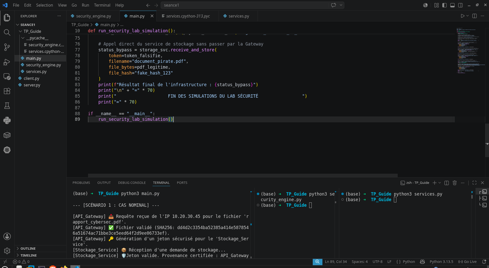

## 🗺️ 1. Architecture Globale du Système


Le système est découpé en plusieurs microservices autonomes qui collaborent de manière sécurisée pour réceptionner, analyser, stocker et indexer les documents académiques ou professionnels.

### Diagramme de Flux et Spécifications Réseau

```text
               ==================================================
               |              UTILISATEUR / CLIENT              |
               ==================================================
                                       |
                                       | HTTP/HTTPS (Port 443)
                                       v
               ==================================================
               |           API GATEWAY (Port 8080)              |
               ==================================================
                 /                     |                    \
  HTTP (Port 8081) /                      | HTTP (Port 8082)   \ gRPC (Port 50051)
               /                       v                    \
+-----------------------+   +-----------------------+   +-----------------------+
|     AUTH SERVICE      |   |   STOCKAGE SERVICE    |   |   RECHERCHE SERVICE   |
+-----------------------+   +-----------------------+   +-----------------------+
|  Moteur : FastAPI     |   |  Moteur : Flask/Python|   |  Moteur : Python-gRPC |
|  Stockage : Redis JWT |   |  Stockage : PostgreSQL|   |  Stockage : ElasSearch|
+-----------------------+   +-----------------------+   +-----------------------+
                                       |                             ^
                                       | Notification Événement      |
                                       +=============================+
                                            Pub/Sub / Async Worker
```
### Structure du Code Source
Le projet est modulaire et structuré de la manière suivante :


* security_engine.py : Moteur cryptographique (HMAC, encodage Base64 URL-safe, vérification des durées d'expiration, et validation binaire des Magic Bytes).
* services.py : Définition des classes d'infrastructure reproduisant fidèlement le comportement isolé de l'API Gateway, du Stockage Service, et du Recherche Service.
* main.py : Point d'entrée de simulation réseau exécutant les scénarios nominaux et d'attaques cybersec.


````md
# Flux de fonctionnement du système

## Le détail du flux : Qui fait quoi ?

Voici le rôle de chaque composant virtuel lors de l’exécution de la commande :

```bash
python3 main.py
````

---

# Scénario 1 : Cas nominal

Le script `main.py` joue le rôle d’un étudiant légitime.

Il prend la variable `pdf_legitime`, lui attribue fictivement :

* IP : `10.20.30.45`
* Nom : `rapport_cybersec.pdf`

Puis il appelle la fonction de l’API Gateway.

## API Gateway

L’API Gateway intercepte les octets du fichier.

Elle :

* lit la signature `%PDF-1.7`
* vérifie que le fichier est réellement un PDF
* calcule l’empreinte numérique SHA256
* génère un jeton sécurisé
* transmet le fichier au service suivant

## Stockage Service

Le service de stockage :

* vérifie le jeton reçu
* enregistre le document dans la base virtuelle
* crée un identifiant unique

Exemple :

```text
Document enregistré avec l'ID #1
```

## Recherche Service

Le service de recherche :

* valide son propre jeton
* indexe le document
* ajoute l’ID dans sa liste de recherche

---

# Scénario 2 : Attaque d’extension masquée

Le script `main.py` joue cette fois le rôle d’un attaquant.

Il envoie :

* un payload PHP malveillant
* renommé en `facture_falsifiee.pdf`

## Détection par l’API Gateway

L’API Gateway :

* ignore le nom du fichier
* inspecte directement les octets
* détecte l’absence de `%PDF-`
* identifie un contenu suspect

Le système bloque immédiatement la requête.

```text
❌ Fichier rejeté : format invalide
```

Le fichier n’atteint jamais les services internes.

---

# Scénario 3 : Tentative de saturation (DDoS)

Le script envoie un fichier volumineux de 3 Mo :

```text
bombe_de_donnees
```

Depuis l’adresse IP :

```text
172.16.5.8
```

## Contrôle de taille

L’API Gateway mesure la taille réelle du fichier.

Résultat :

* Taille reçue : `3145728 octets`
* Limite maximale : `2097152 octets (2 Mo)`

Le système bloque alors automatiquement la requête afin de protéger les ressources du serveur.

---

# Scénario 4 : Contournement de la Gateway

Le script simule un pirate tentant d’ignorer complètement l’API Gateway.

L’attaquant appelle directement le `Stockage_Service` avec :

* un faux jeton
* une signature falsifiée

## Vérification de sécurité

Le service de stockage :

* vérifie la signature cryptographique
* compare le jeton avec la clé secrète du cluster

La signature est invalide.

Le système déclenche alors une alerte de sécurité :

```text
🚨 VIOLATION DE SÉCURITÉ
```

Aucune donnée n’est enregistrée.

---

# Résumé de la sécurité du système

Le projet démontre plusieurs mécanismes de cybersécurité :

* Validation du type réel des fichiers
* Vérification cryptographique
* Protection contre les faux jetons
* Limitation de taille des requêtes
* Isolation des services
* Contrôle d’accès inter-services
* Détection d’anomalies

```
```
