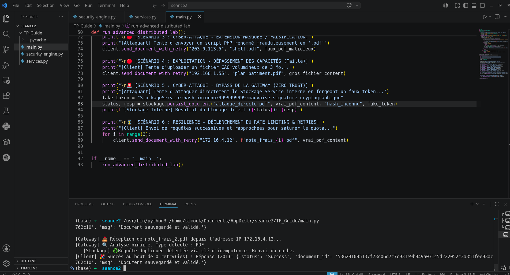

## Évolutions Majeures & Résolution des Défis Répartis


### Implémentation de l'Idempotence (Déduplication)
* Défi : En cas de micro-coupure réseau juste après l'écriture physique d'un fichier, le client peut subir un Timeout et renvoyer exactement le même fichier. Sans protection, le serveur créerait des doublons en base de données.
* Solution de la Séance 6 : Le StockageService calcule une clé d'idempotence unique (upload:<file_hash>) et l'enregistre dans un cache transactionnel (idempotency_cache). Si la même requête se présente à nouveau, le service intercepte l'appel, n'écrit rien sur le disque et renvoie instantanément la réponse mémorisée.

```text
 Client Applicatif                   API Gateway                  Stockage Service
       │                                  │                               │
       │─── 1. POST /api/v1/documents ───>│                               │
       │    (Payload, Client_IP, etc.)    │                               │
       │                                  │── 2. Inspection binaire ──┐   │
       │                                  │    (Magic Bytes & Taille) │   │
       │                                  │<──────────────────────────┘   │
       │                                  │                               │
       │                                  │── 3. Génération Jeton ────┐   │
       │                                  │    (HMAC lié au Hash)     │   │
       │                                  │<──────────────────────────┘   │
       │                                  │                               │
       │                                  │──────── 4. RPC / Transmit ───>│
       │                                  │     (Payload + Token unique)  │
       │                                  │                               │
       │                                  │                               │── 5. Vérification ──┐
       │                                  │                               │    Idempotence      │
       │                                  │                               │<────────────────────┘
       │                                  │                               │
       │                                  │                               │── 6. Validation ────┐
       │                                  │                               │    Token (Zero-Trust)│
       │                                  │                               │<────────────────────┘
       │                                  │                               │
       │                                  │<─────── 7. HTTP 201 Created ──│
       │                                  │        (Ack + Doc_ID)         │
       │<───────── 8. HTTP 201 ───────────│                               │
       │                                  │                               │


  '''''''

---

## 🏗️ 2. Évolutions Majeures & Résolution des Défis Répartis (Séance 6)

### A. Implémentation de l'Idempotence (Déduplication)
* **Défi** : En cas de micro-coupure réseau juste après l'écriture physique d'un fichier, le client peut subir un *Timeout* et renvoyer exactement le même fichier. Sans protection, le serveur créerait des doublons en base de données.
* **Solution de la Séance 6** : Le `StockageService` calcule une **clé d'idempotence unique** (`upload:<file_hash>`) et l'enregistre dans un cache transactionnel (`idempotency_cache`). Si la même requête se présente à nouveau, le service intercepte l'appel, n'écrit rien sur le disque et renvoie instantanément la réponse mémorisée.

### B. Stratégie de Reprise : Backoff Exponentiel et Full Jitter
* **Défi** : Si le serveur renvoie une erreur transitoire de surcharge (`429 Too Many Requests`), un client naïf ré-attaquerait immédiatement, provoquant une surcharge en cascade appelée **Retry Storm** (tempête de reconnexions).
* **Solution de la Séance 6** : Le `ResilientClient` implémente un algorithme de temporisation :
  1. **Backoff Exponentiel** : Le délai d'attente double à chaque tentative échouée ($Délai = Base \\times 2^{tentative}$).
  2. **Full Jitter** : Un bruit aléatoire basé sur le module de sécurité `secrets` applique une distribution uniforme de l'attente entre $0$ et le $Délai$ calculé. Cela permet de lisser la charge réseau des clients déconnectés.

### C. Durcissement Cryptographique des Jetons (Token Binding)
* **Défi** : Un jeton d'authentification inter-service volé sur le réseau ne doit pas pouvoir être réutilisé pour injecter un autre document.
* **Solution de la Séance 6** : Le jeton HMAC-SHA256 lie désormais **le contexte d'usage et l'empreinte binaire (SHA256) du fichier** :
  $$\\text{Payload} = \\text{Service Cible} : \\text{Hash du document} : \\text{Timestamp Expiration}$$
  Si un pirate tente d'utiliser ce jeton pour uploader un fichier modifié, le `StockageService` détecte l'incohérence et lève une alerte.

---

## 🔒 3. Matrice de Sécurité & Contrôles aux Frontières

Le système applique la défense en profondeur en combinant la résilience et la cybersécurité :

| Fonctionnalité de Contrôle | Vecteur de Menace Atténué | Implémentation Technique |
| :--- | :--- | :--- |
| **Fenêtre Glissante (Rate Limit)** | Dénis de service (DoS / Brute-force) | Analyse de l'historique des requêtes par IP sur les 60 dernières secondes. |
| **Inspection des Magic Bytes** | Injections de fichiers / Masquage d'extension | Vérification des premiers octets du flux d'octets (`%PDF-`, `\\x89PNG`, etc.). |
| **Jeton Inter-Service Éphémère** | Usurpation d'identité / Contournement Gateway | Signature HMAC-SHA256 valide pendant 5 secondes maximum. |
| **Comparaison en Temps Constant** | Attaques temporelles (*Timing Attacks*) | Validation des signatures via `hmac.compare_digest`. |

---

## 💻 4. Structure des Fichiers

* `security_engine.py` : Moteur de cryptographie (HMAC, SHA256), de validation binaire (*Magic Bytes*) et d'injection d'aléa informatique (*Jitter*).
* `services.py` : Contient l'implémentation de la passerelle d'API (`APIGateway`) et du service de persistance équipé de son cache d'idempotence (`StockageService`).
* `main.py` : Script d'orchestration simulant le client réseau résilient et déroulant les scénarios de test.

---

## 🚀 5. Guide d'Exécution du Laboratoire

### Lancement de la simulation
Exécutez le script principal depuis votre terminal :
```bash
python3 main.py
