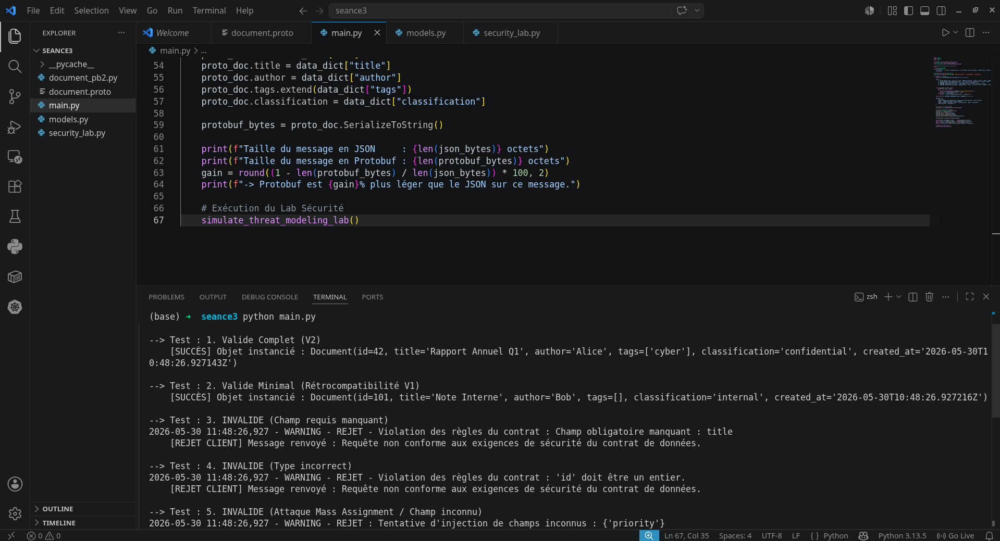

# 🔒 Applications Réparties & Cybersécurité — Sérialisation, Marshalling & Threat Modeling

Ce projet met en œuvre des pratiques avancées de **sérialisation sécurisée**, de contrôle des formats de données en transit (JSON et Google Protocol Buffers), ainsi qu'un laboratoire pratique de **Threat Modeling** basé sur le principe du *Fail-Closed*.

L'objectif de cette architecture modulaire est de démontrer comment intercepter les vecteurs d'attaque courants liés aux flux réseau (Mass Assignment, DoS par injection récursive, RCE, et Data Tampering).

## 🚀 Architecture des Fichiers

Le projet a été découpé de manière modulaire afin d'isoler la logique métier des couches de transport et de sécurité :

* **`models.py`** : Définition des structures de données (`Document`) via des Dataclasses Python et implémentation d'un validateur de contrat strict.
* **`security_lab.py`** : Laboratoire de simulation et d'analyse des menaces cyber (Threat Modeling, signatures cryptographiques HMAC).
* **`main.py`** : Point d'entrée principal de l'application orchestrant les cas de test, la validation v1/v2 et le benchmark de performances.
* **`document.proto`** & **`document_pb2.py`** : Schéma et stubs compilés Google Protocol Buffers pour la sérialisation binaire optimisée.

---

## 🛠️ Concepts & Fonctionnalités Clés

### 1. Contrat JSON Strict & Validation Fail-Closed
Toute désérialisation applique une validation exhaustive (types natifs, allowlists de classification, format ISO 8601 strict). À la moindre non-conformité, le payload est intégralement rejeté sans traitement partiel (*Fail-Closed*), protégeant l'application contre l'injection de structures inattendues.

### 2. Gestion du Versioning (v1 ⇄ v2)
Le désérialiseur gère la rétrocompatibilité. Un flux hérité de version 1 (sans tags ni métadonnées) est dynamiquement complété par des valeurs par défaut sécurisées lors de sa lecture par un composant v2, tout en bloquant les tentatives d'injections de champs non déclarés (*Mass Assignment*).

### 3. Optimisation Binaire via Google Protobuf
Comparaison des performances entre le format textuel JSON et le format binaire structuré Protobuf.


### 4. Laboratoire de Threat Modeling
Le module de sécurité simule l'interception et le blocage automatique de 3 menaces majeures :
* **Menace 1 (RCE) :** Évitement des injections d'objets dynamiques (ex. `pickle` ou `yaml.load` non sécurisé) par l'usage strict de formats de données inertes.
* **Menace 2 (DoS) :** Interception en amont des bombes logiques d'imbrication récursive par un contrôle strict de la taille brute du payload en octets.
* **Menace 3 (Tampering) :** Garantie d'intégrité de la classification des données à l'aide d'un jeton d'authentification de message **HMAC-SHA256**.

---

## 🏁 Guide d'Exécution

### Préréquis
* Python 3.12+ (conforme à l'utilisation moderne de `datetime.UTC`)
* Le compilateur Google Protobuf (`protoc`) installé sur votre système.

### Installation & Lancement

* **Compilez le schéma Protobuf :** protoc --python_out=. document.proto
*  ** Exécutez l'application globale :** python main.py


1. **Installez la dépendance requise :**
   ```bash
   pip install protobuf
