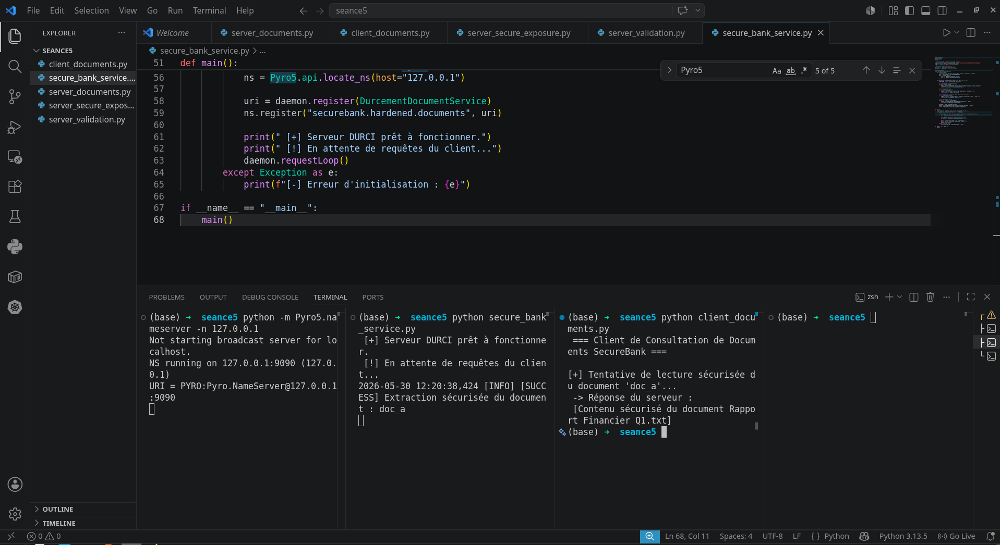

# 🛡️ Sécurité des Applications Réparties — Invocation d'Objets Distants (RMI) avec Pyro5

[](https://www.python.org)
[](https://pyro5.readthedocs.io/)
[]()

Ce dépôt contient l'implémentation complète et durcie de la **Séance 10** relative aux architectures distribuées orientées objets en Python. L'application simule un service de gestion documentaire bancaire pour l'entité fictive **SecureBank**, mettant en évidence les vulnérabilités classiques des appels distants (RMI) non sécurisés et apportant des contre-mesures concrètes conformes aux standards de l'industrie.

---

## 🚀 Architecture Globale du Système

L'infrastructure réseau repose sur un couplage à trois composants pour assurer une transparence de localisation complète :
1. **L'Annuaire de Noms (Name Server) :** Fait office de "Pages Jaunes" réseau en associant un nom logique (`securebank.hardened.documents`) à une URI physique changeante.
2. **Le Serveur Durci (Daemon) :** Instancie l'objet métier, applique les restrictions de sécurité, restreint l'écoute à l'interface locale et traite les requêtes.
3. **Le Client Transparent (Proxy) :** Récupère la référence distante via l'annuaire et intercepte les appels locaux pour les acheminer de manière transparente sur le réseau.

---

## 🛡️ Matrice de Sécurité & Durcissement (Lab Sécurité)

Dans le cadre du durcissement du service naïf d'origine, plusieurs barrières défensives strictes ont été implémentées :

| Menace d'origine | Impact Potentiel | Solution Technique Implémentée (Code Durci) |
| :--- | :--- | :--- |
| **Exposition excessive (Over-exposure)** | Fuite de clés secrètes d'infrastructure (ex: `secret_key`). | **Encapsulation stricte** via des variables locales privées (`self.__secret_key`) sans décorateur `@expose`. |
| **Accès anonyme / Non authentifié** | Vol de données et lecture illimitée de documents bancaires. | **Contrôle d'accès par Jeton** (`token`) obligatoire à l'entrée de chaque méthode exposée. |
| **Injection de chemin (Path Traversal)** | Lecture arbitraire de fichiers système critiques (`/etc/passwd`). | **Sanitisation par Expression Régulière** (`^[a-zA-Z0-9_-]+$`) limitant strictement les formats autorisés et contrôle de type via `isinstance()`. |
| **Fuite d'informations (Information Disclosure)** | Divulgation de l'arborescence serveur via les traces d'exceptions (`Stack trace`). | **Gestion étanche des exceptions** via un bloc `try/except` global, masquant les erreurs réelles du système par un message neutre au client. |
| **Exécution de code arbitraire (RCE)** | Prise de contrôle totale de la machine hôte lors de la désérialisation. | **Bannissement de Pickle** au profit du sérialiseur par défaut de Pyro5, **Serpent**, qui n'instancie pas de classes Python arbitraires. |

---

## 📂 Structure des Fichiers du Projet

* `secure_bank_service.py` : Le code serveur final de production. Il embarque la classe sécurisée `DurcementDocumentService`, le logger d'audit et la configuration réseau restrictive.
* `client_documents.py` : Le client de test automatisé. Il valide la communication nominale et exécute trois scénarios d'attaques simulés (fuzzing, injection, usurpation de token) pour valider l'étanchéité du serveur.

---

## 🛠️ Guide de Déploiement et d'Exécution

Pour exécuter et tester ce laboratoire sur votre machine locale, ouvrez **trois terminaux distincts** dans l'ordre suivant :

### 1️⃣ Étape 1 : Lancer l'Annuaire de Noms : python secure_bank_service.py
Forcez l'annuaire à écouter sur l'interface locale `127.0.0.1` pour éviter toute exposition extérieure :
```bash
python -m Pyro5.nameserver -n 127.0.0.1
```
### Exécuter la Suite de Tests d'Audit : python client_documents.py


